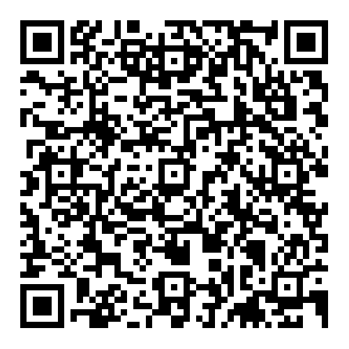
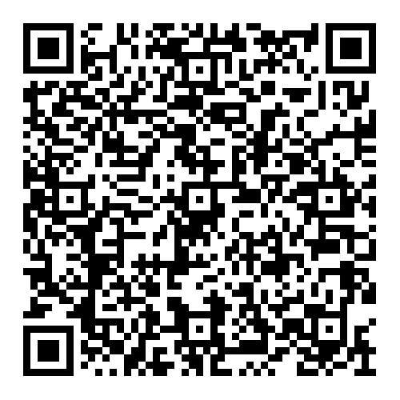

# FridgeNaut

## Android builds

### Main (release) build from `main` branch

[⬇️ Download latest main APK](https://github.com/Tiny-Clowns/FridgeNaut/releases/download/android-main/fridgenaut-main-release.apk)

Scan on your phone:



---

### Test (debug) build from `test` branch

[⬇️ Download latest test APK](https://github.com/Tiny-Clowns/FridgeNaut/releases/download/android-test/fridgenaut-test-debug.apk)

Scan on your phone:



## Features

### Receipt Scanning (On-Device OCR)

FridgeNaut supports on-device receipt scanning powered by Google ML Kit Text Recognition.  
All processing runs locally — **no internet required**.

#### Running on Android

The app requests camera permission at runtime. The following permission is declared in `AndroidManifest.xml`:

```xml
<uses-permission android:name="android.permission.CAMERA"/>
```
